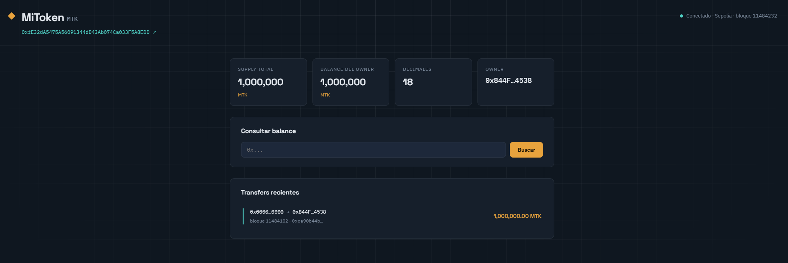

# ERC-20 Token Dashboard

A full-stack Web3 project: a custom ERC-20 token written in Solidity, deployed to the Ethereum Sepolia testnet, paired with a live on-chain dashboard built with Flask + web3.py.



## What this project demonstrates

- Writing and deploying a Solidity smart contract (ERC-20 standard, via OpenZeppelin)
- Reading live on-chain data with `web3.py` — no database involved, every number on the dashboard is a fresh call to the blockchain
- A Flask backend serving a server-rendered dashboard
- End-to-end Web3 tooling: MetaMask, testnet faucets, Remix IDE, Etherscan

## Live deployment

| | |
|---|---|
| Network | Ethereum Sepolia (testnet) |
| Token | MiToken (`MTK`) |
| Contract address | [`0xfE32dA5475A56091344dD43Ab074Ca033F5A8EDD`](https://sepolia.etherscan.io/address/0xfE32dA5475A56091344dD43Ab074Ca033F5A8EDD) |
| Deployed via | [Remix IDE](https://remix.ethereum.org) |

> This runs on a public testnet. The token has no real-world monetary value — the project exists to demonstrate the full contract → dashboard pipeline end to end.

## Architecture

```
MiToken.sol  ──deploy──>  Sepolia testnet
                                │
                                │  eth_call / eth_getLogs
                                ▼
                        web3.py (Flask backend)
                                │
                                ▼
                    Server-rendered dashboard (Jinja2)
```

## Features

- Live token stats: name, symbol, total supply, decimals
- Owner address and owner balance
- Balance lookup for any wallet address
- Recent `Transfer` events, read directly from contract logs
- `mint()` (owner-only) and `burn()` built into the contract

## Tech stack

- **Smart contract:** Solidity ^0.8.20, OpenZeppelin (`ERC20`, `Ownable`)
- **Backend:** Python, Flask, web3.py
- **Frontend:** Jinja2 templates, vanilla CSS
- **Tooling:** Remix IDE, MetaMask, Sepolia testnet

## Project structure

```
erc20-token-dashboard/
├── contract/
│   └── MiToken.sol         # ERC-20 token contract
├── abi/
│   └── MiToken.json        # Contract ABI used by the backend
├── app.py                  # Flask app + web3.py logic
├── templates/
│   └── index.html
├── static/
│   └── style.css
├── requirements.txt
├── .env.example
└── docs/
    └── dashboard-screenshot.png
```

## Running it locally

```bash
# 1. Clone
git clone https://github.com/<your-username>/erc20-token-dashboard.git
cd erc20-token-dashboard

# 2. Virtual environment
python -m venv venv
venv\Scripts\activate      # Windows
source venv/bin/activate   # macOS/Linux

# 3. Install dependencies
pip install -r requirements.txt

# 4. Configure environment
copy .env.example .env     # Windows
cp .env.example .env       # macOS/Linux

# 5. Run
python app.py
```

Then open `http://127.0.0.1:5000`.

The dashboard is **read-only** — it never handles or requests a private key.

## Contract overview

`MiToken.sol` extends OpenZeppelin's `ERC20` and `Ownable`:

- Standard ERC-20 interface (`transfer`, `approve`, `transferFrom`, `balanceOf`, ...)
- `mint(address, uint256)` — owner-only, for issuing additional supply
- `burn(uint256)` — any holder can burn their own tokens

## Possible next steps

- Transfer/mint/burn actions from the dashboard UI (signed with a dedicated testnet-only wallet)
- Supply / transfer history chart over time
- Deploy the dashboard to a small home server

## License

MIT — see [LICENSE](LICENSE).
